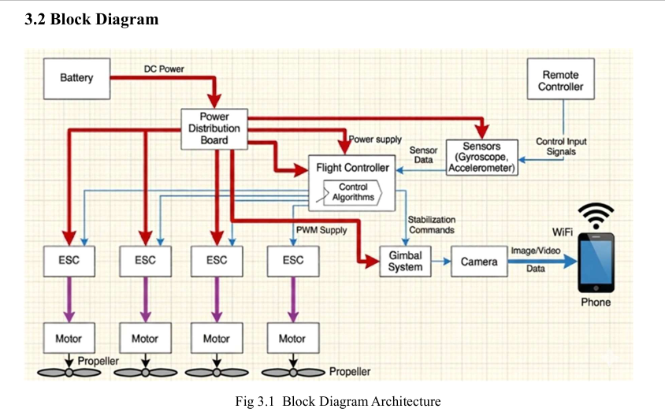
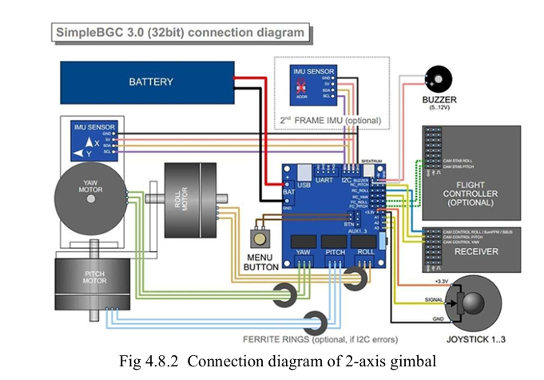

# 🚁 Quadcopter Drone with 2-Axis Gimbal Camera System

A hardware-based quadcopter drone developed with a 2-axis gimbal camera stabilization system for stable aerial imaging.

## 📌 Project Overview

This project focuses on the design, assembly, calibration, and testing of a quadcopter drone integrated with a 2-axis gimbal camera system.

The quadcopter uses a Pixhawk 2.4.8 flight controller, brushless DC motors, Electronic Speed Controllers (ESCs), GPS, LiPo battery, radio transmitter/receiver, and a 2-axis gimbal system.

The gimbal stabilizes the camera along the **pitch and roll axes**, reducing the effect of drone movement and vibrations during aerial imaging.

## 🎯 Objectives

* Design and assemble a functional quadcopter drone.
* Implement flight control using the Pixhawk 2.4.8 flight controller.
* Integrate sensors and GPS for controlled flight.
* Integrate a 2-axis gimbal for camera stabilization.
* Reduce vibration and unwanted camera movement.
* Perform calibration and flight testing.
* Analyse the flight and imaging performance of the developed system.

## ⚙️ Key Features

* Pixhawk 2.4.8 flight controller
* Four brushless DC motors
* 30A ESCs
* GPS-based flight functionality
* Radiomaster Pocket transmitter and receiver
* 3S 3300mAh LiPo battery
* 2-axis camera gimbal
* Action camera
* Manual and assisted flight modes
* Hardware assembly, calibration and flight testing

## 🧩 System Architecture

The system consists of the following major subsystems:

**Remote Controller → RC Receiver → Pixhawk Flight Controller → ESCs → Brushless Motors → Propellers**

The Pixhawk receives control inputs and sensor information, processes the data using flight-control algorithms, and generates control signals for the ESCs.

The ESCs control the speed of the brushless motors, which generate the thrust required for flight.

The gimbal system works separately to compensate for unwanted pitch and roll movement and maintain camera orientation.

## 📊 System Block Diagram

## 🔩 Hardware Components

| Component         | Specification / Model | Purpose                          |
| ----------------- | --------------------- | -------------------------------- |
| Frame             | TBS 500               | Mechanical structure             |
| Flight Controller | Pixhawk 2.4.8         | Flight control and stabilization |
| Motors            | EMAX MT2213 935KV × 4 | Generate thrust                  |
| ESCs              | 30A × 4               | Control motor speed              |
| Battery           | 3S 3300mAh LiPo       | Power source                     |
| GPS               | Ublox Neo-M8N         | Position and navigation data     |
| Transmitter       | Radiomaster Pocket    | Pilot control                    |
| Receiver          | RP1 V2                | Receives radio commands          |
| Gimbal            | 2-Axis BGC Gimbal     | Camera stabilization             |
| Camera            | Action Camera         | Aerial image/video capture       |

## 🔄 Working Principle

The pilot sends throttle, roll, pitch, and yaw commands through the radio transmitter.

The receiver sends these commands to the Pixhawk flight controller.

The Pixhawk processes the pilot commands together with sensor data and calculates the required motor speeds.

The corresponding PWM signals are sent to the ESCs.

The ESCs control the brushless motors, and the motors rotate the propellers to generate thrust and control the movement of the quadcopter.

At the same time, the 2-axis gimbal compensates for unwanted pitch and roll movements to maintain a stable camera orientation.

## 🎥 2-Axis Gimbal System

The gimbal stabilizes the camera along two axes:

* **Pitch**
* **Roll**

The system uses a gimbal controller, sensors, and motors to compensate for unwanted movement.

Compared with a 3-axis system, the 2-axis gimbal provides a simpler, lighter, and more cost-effective stabilization solution.

## 🔧 Assembly and Implementation

The project involved:

1. TBS 500 frame assembly
2. Motor mounting
3. ESC installation and connection
4. Power distribution
5. Pixhawk installation
6. GPS installation
7. Receiver installation
8. Gimbal and camera integration
9. Radio controller configuration
10. Sensor calibration
11. Motor testing
12. Flight testing

## 🧭 Calibration

The drone was configured and calibrated using Mission Planner.

The calibration process included:

* Accelerometer calibration
* Compass calibration
* Radio calibration
* ESC calibration
* Motor testing
* Flight-mode configuration

## ✈️ Flight Modes

The project was tested/configured with different Pixhawk flight modes, including:

* Stabilize
* Altitude Hold
* Loiter
* Auto
* Return to Launch (RTL)
* Land
* Acro

## 📈 Results

The complete quadcopter system was successfully assembled and tested.

The reported total system weight was approximately **1163 g**.

The system included the TBS 500 frame, Pixhawk 2.4.8, four EMAX MT2213 935KV motors, four 30A ESCs, 3S 3300mAh LiPo battery, GPS, 2-axis gimbal, camera, and radio-control system.

The project report also reports improved image stability with the 2-axis gimbal during testing.

### Reported Performance

* Total system weight: ~1163 g
* Thrust-to-weight ratio: ~2.4:1
* Reported gimbal stabilization efficiency: 82–91%
* Usable video frames without gimbal: 45%
* Usable video frames with gimbal: 92%

## 🎬 Flight Testing Video

The actual flight-testing video is included in this repository.

**[▶️ Open Flight Testing Video](video/drone-testing.mp4)**

## 📷 Project Images

Project photographs are available in the [`images`](images/) folder.

## 📄 Project Report

The complete project report is available here:

**[📥 View Project Report](documentation/Quadcopter-Drone-2-Axis-Gimbal-Project-Report.pdf)**

## 🌐 Portfolio

The project and testing video are also available on my personal portfolio website.

**[Visit My Portfolio](YOUR_PORTFOLIO_LINK)**

## 🚀 Future Scope

Possible future improvements include:

* 3-axis gimbal stabilization
* AI and computer vision
* Autonomous waypoint-based missions
* Obstacle detection and avoidance
* Improved battery life and flight endurance
* Real-time FPV video transmission

## 👨‍💻 Team Members

* **Shubham Sirsat**
* **Navnath Rohokale**
* **Hamja Sayyad**

### Project Guide

**Dr. Anita K. Patil**

### Institution

**Dr. Vithalrao Vikhe Patil College of Engineering, Ahilyanagar**

Department of Electronics and Telecommunication Engineering

## 📌 Project Status

**Completed — Hardware assembled, calibrated and flight tested.**
